# iOS9-Swift2-Tinder

Swift 2, Facebook integration and Parse BaaS application that allow users to 

1. Login using their FaceBook credentials - access to public profile and email
2. Signup for application with preference to show if the user is interested in male/female
3. Swipe to accept/reject other user's within a block of 2 latitude and longitude. Automatically show the new user in the list once the current user has been accepted/rejected.
4. See the picture, name and email of those users whom the current user has accepted and who have in turn accepted the current user.

## Pre-requisites

1. XCode 7 with Swift 2 and iOS 9

## Setup

1. Clone the project from GitHub `https://github.com/anilallewar/iOS9-Swift2-Tinder`
2. Open `Tinder.xcodeproj` in XCode.
3. Parse setup
  1. Create a new project in [Parse](https://www.parse.com/) and note the application ID and client key for your application. Use the Parse [Quickstart](https://www.parse.com/apps/quickstart) to get started quickly. 
  2. Open the `ParseStarterProject/AppDelegate.swift` file and make changes for Parse application ID and client key.
```
        //Uncomment and fill in with your Parse credentials:
        Parse.setApplicationId("<<Your_Application_Id>>",
            clientKey: "<<Your_client_key>>")
```

4. Facebook setup
  1. You can continue to use the existing facebook integration made with my id.
  2. If you need to create your own Facebook app for integration
    1. Login in to [Facebook Developers](https://developers.facebook.com/) and add a new app.
    2. Goto the "Settings" screen and add your email id, bundle id of your application which should be the same as the bundle identifier of your XCode project.
    3. Goto the "Status & Review" screen and make the app and all it's live features available to the public.
    4. Add the Facebook FBSDKCoreKit.framework and FBSDKLoginKit.framework bundles to the application; they are already bundled with this application.
    5. Open the `info.plist` file and make changes to the following entries based on your Facebook app.

            ``` 
            
            <key>CFBundleURLTypes</key>
            <array>
                <dict>
                    <key>CFBundleURLSchemes</key>
                    <array>
                        <string>fb426330234223366</string>
                    </array>
                </dict>
            </array>
            <key>FacebookAppID</key>
            <string>426330234223366</string>
            <key>FacebookDisplayName</key>
            <string>Tinder</string>
            <key>LSApplicationQueriesSchemes</key>
            <array>
                <string>fbauth</string>
            </array>
            <key>NSAppTransportSecurity</key>
            <dict>
                <key>NSAllowsArbitraryLoads</key>
                <true/>
            </dict>
            ```
---            
**Note:** *Add the entries through info.plist at the end; don't copy-paste it in the source file. If the entries don't stay in order they create arbitary problems*

5. Build and run the application on the XCode simulator to signup using Facebook and enjoy the app!
6. You might need to click on the login button again after initially providing the facebook credentials.

## Screenshots
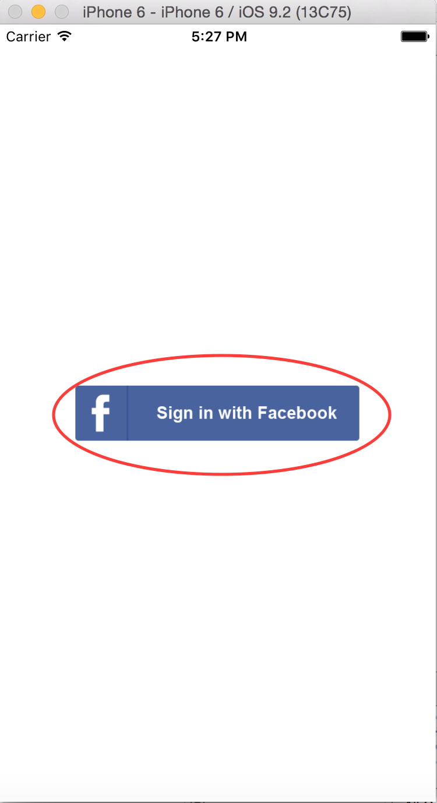 &nbsp;&nbsp;&nbsp;&nbsp;
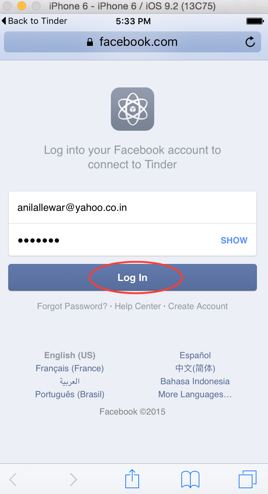 &nbsp;&nbsp;&nbsp;&nbsp;
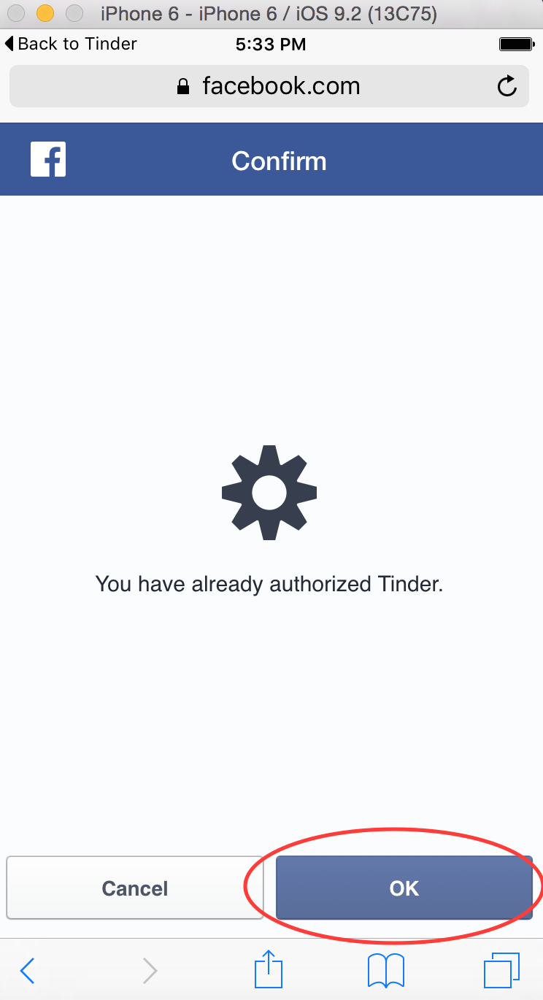
<br/>
---
<br/>
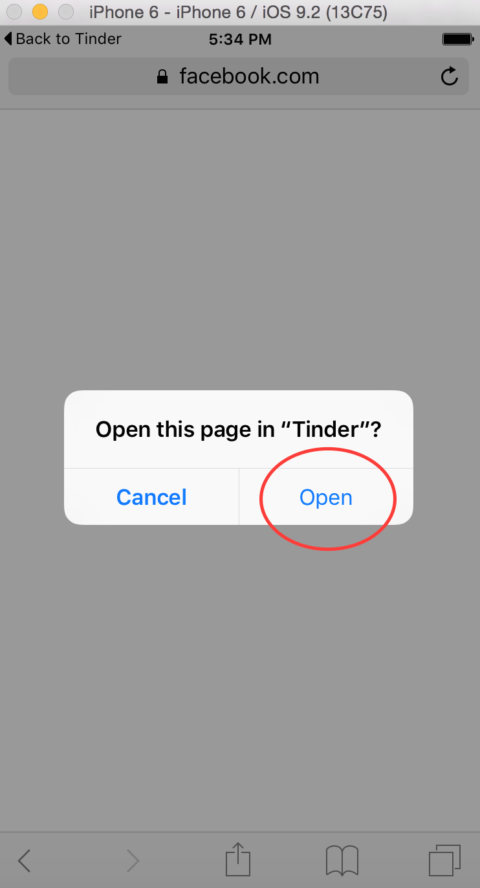 &nbsp;&nbsp;&nbsp;&nbsp;
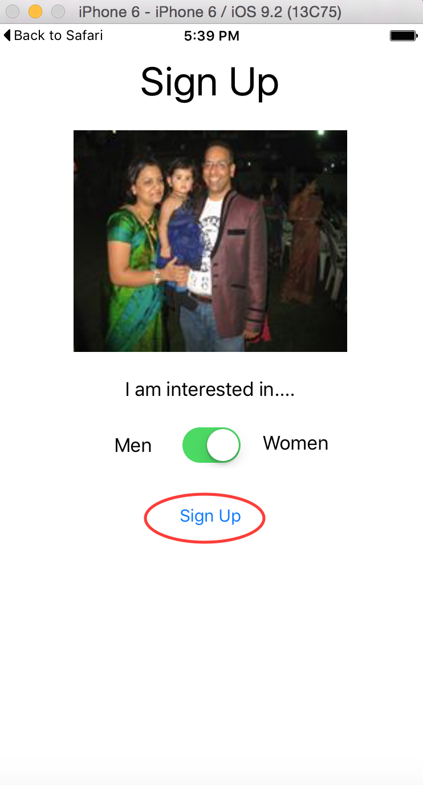 &nbsp;&nbsp;&nbsp;&nbsp;
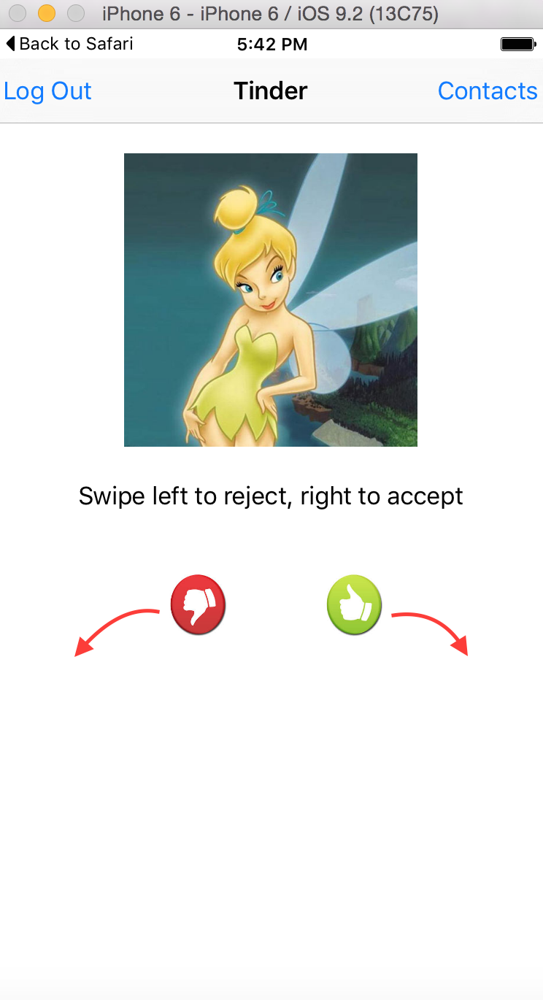
<br/>
---
<br/>
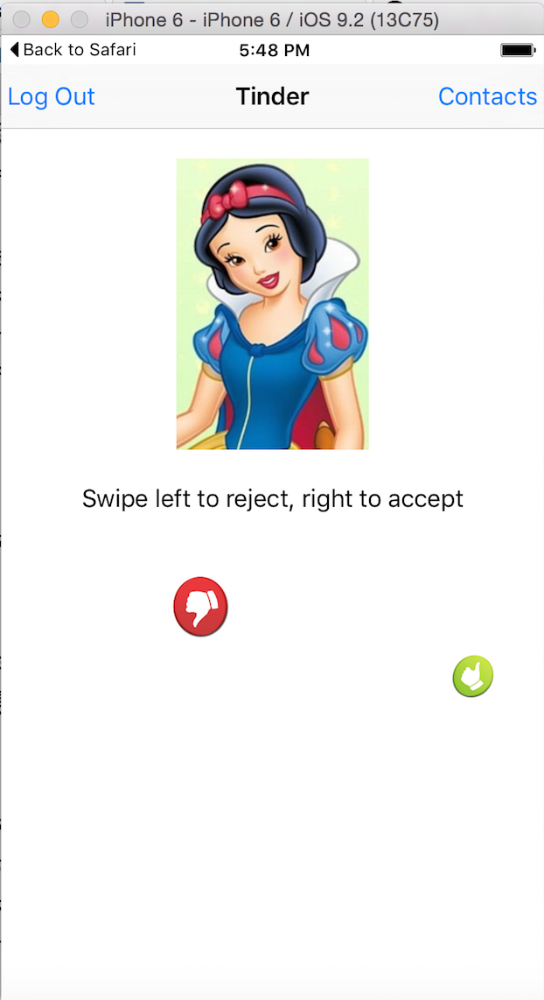 &nbsp;&nbsp;&nbsp;&nbsp;
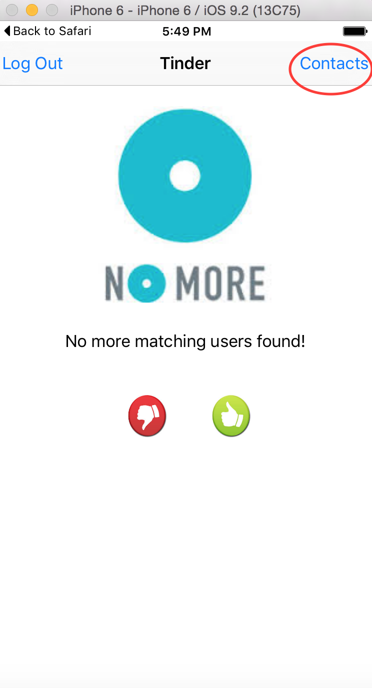 &nbsp;&nbsp;&nbsp;&nbsp;
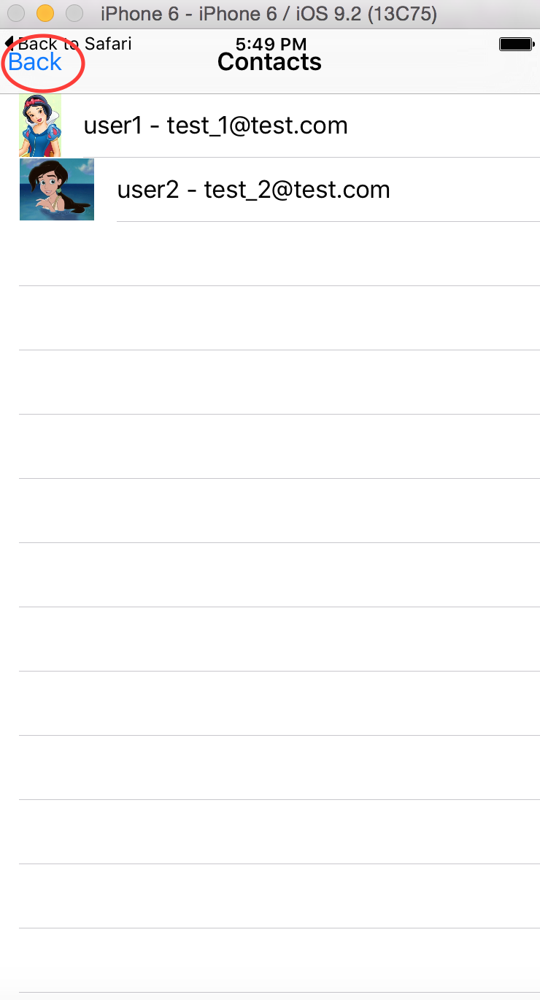
<br/>
---
<br/>
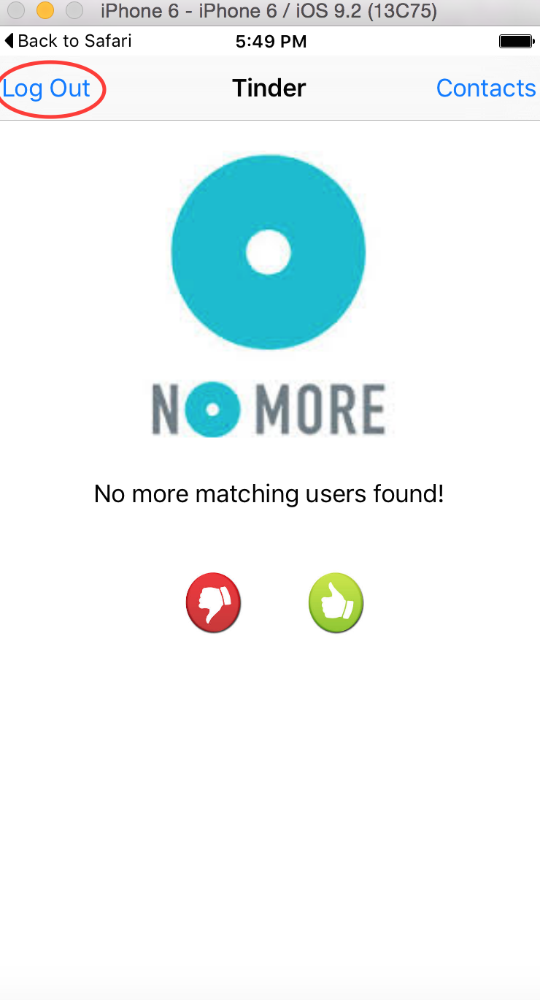 &nbsp;&nbsp;&nbsp;&nbsp;
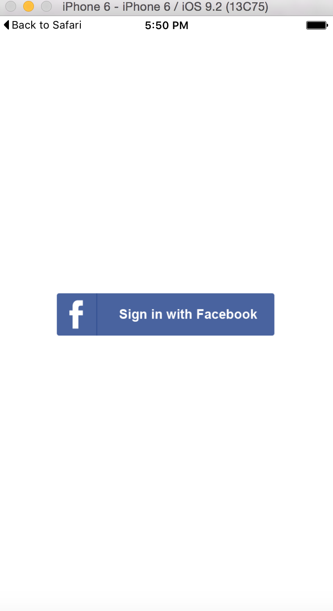 &nbsp;&nbsp;&nbsp;&nbsp;
<br/>
---
